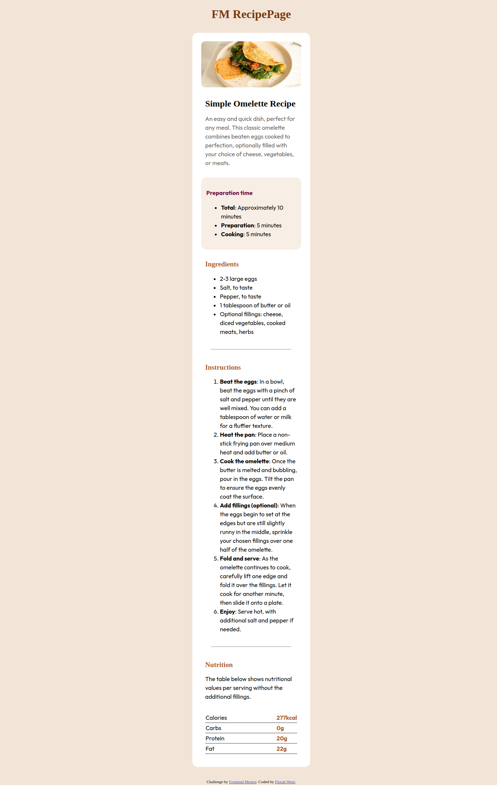
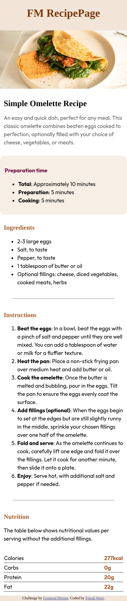

# Frontend Mentor - Recipe page solution

This is a solution to the [Recipe page challenge on Frontend Mentor](https://www.frontendmentor.io/challenges/recipe-page-KiTsR8QQKm). Frontend Mentor challenges help you improve your coding skills by building realistic projects. 

## Table of contents

- [Overview](#1)
  - [The challenge](#1.1)
  - [Screenshot](#1.2)
  - [Links](#1.3)
- [My process](#2)
  - [Built with](#2.1)
  - [What I learned](#2.2)
  - [Continued development](#2.3)
  - [Useful resources](#2.4)
- [Author](#3)

## Overview

Recipe Page, newbie Frontend Mentor challenge. This is the second challenge that I have taken up. I have decided to continue developing the solution with HTML and CSS. 

### Screenshots

#### Desktop Screenshot


#### Mobile Screenshot


### Links

- Solution URL: [Github](https://github.com/FWeni/RecipePage)
- Live Site URL: [Gitpages](https://fweni.github.io/RecipePage/)

## My process

### Built with

- Semantic HTML5 markup
- CSS custom properties
- Flexbox
- CSS Grid
- Mobile-first workflow

### What I learned

Feedback from the previous review really help, I found myself basically applying a few of the pointers I received to complete this project. I learned a few more html tags as well.

To see how you can add code snippets, see below:

```html
<li>
  <b>Total</b>: Approximately 10 minutes
</li>
```
```css
table {
  border-collapse: collapse;
}

tr{
  border-bottom: 0.13rem solid #a09d9a;
}
```


### Continued development

I want to continue developing with HTML, CSS and Javascript, on a couple of projects. I want to truly learn responsive web development. 

### Useful resources

- [w3schools](https://www.w3schools.com/) - This helped me with implementing some compontents in the solution. like making certian sections of the text be bold, I used the b tag and hr tag I used for the line that is acting as a divider.
- [Deque University](https://dequeuniversity.com/rules/axe/4.6/region?application=axeAPI) - This is an amazing article which helped me finally understand the landmarks. I'd recommend it to anyone who is still new to HTML or coding.
- [Piccalilli](https://piccalil.li/blog/a-more-modern-css-reset/) - I have referenced how to reset css from this site.

## Author

- Frontend Mentor - [@FWeni](https://www.frontendmentor.io/profile/FWeni)
